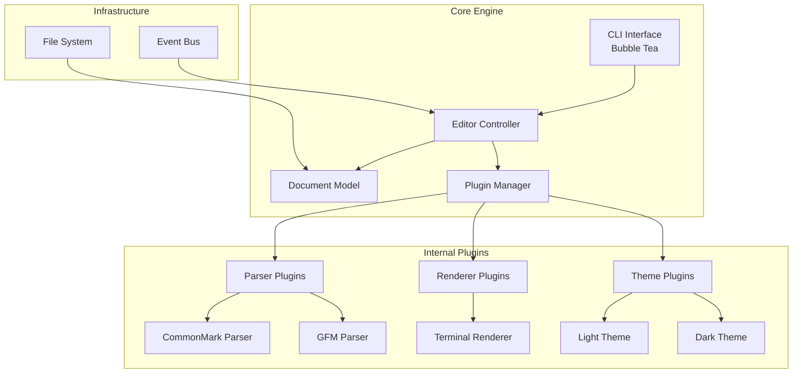
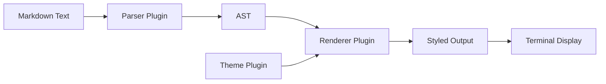

# MDE - Markdown Editor CLI Specification

## Executive Summary
Production-ready terminal markdown editor built in Go with plugin-based architecture for parsing, rendering, and theming. Designed for LLM-driven development with emphasis on modularity and extensibility.

## Architecture Overview



## Core Components

### 1. CLI Interface Layer
- **Framework**: Bubble Tea (Elm Architecture)
- **Components**:
  - `cmd/mde/main.go` - Entry point
  - `internal/tui/app.go` - Main TUI application
  - `internal/tui/viewport.go` - Scrollable viewport
  - `internal/tui/editor.go` - Editor component

### 2. Document Model
- **AST-based** document representation
- **Cursor management** with selection support
- **Live preview** synchronization

```go
type Document struct {
    AST      ast.Node
    Content  string
    Cursor   Position
}
```

### 3. Internal Plugin Architecture

#### Parser Plugin Interface
```go
type ParserPlugin interface {
    Name() string
    Parse(content string) (ast.Node, error)
    SupportedExtensions() []string
}
```

#### Renderer Plugin Interface
```go
type RendererPlugin interface {
    Name() string
    Render(node ast.Node, theme Theme) string
    SupportedNodeTypes() []ast.NodeType
}
```

#### Theme Plugin Interface
```go
type Theme interface {
    Name() string
    GetStyle(element string) Style
    Palette() ColorPalette
}
```

### 4. Plugin Registry
- **Internal registration** - Plugins compiled into binary
- **Clean interfaces** - Easy to add new parsers/renderers
- **Future extensibility** - Architecture supports external plugins later

```go
type PluginRegistry struct {
    parsers   map[string]ParserPlugin
    renderers map[string]RendererPlugin
    themes    map[string]Theme
}

// Built-in plugins registered at startup
func init() {
    registry.RegisterParser("commonmark", &CommonMarkParser{})
    registry.RegisterParser("gfm", &GFMParser{})
    registry.RegisterRenderer("terminal", &TerminalRenderer{})
    registry.RegisterTheme("light", &LightTheme{})
    registry.RegisterTheme("dark", &DarkTheme{})
}
```

## Technology Stack

### Core Libraries
- **Markdown Parser**: goldmark (CommonMark compliant, extensible)
- **TUI Framework**: Bubble Tea + Bubbles
- **Styling**: Lip Gloss (ANSI styling)
- **Configuration**: None - sensible defaults only

### Testing Stack
- **Unit Testing**: Standard Go testing
- **Integration**: testify/suite
- **Mocking**: gomock
- **Terminal Testing**: vhs (terminal recording)

## Key Features Implementation

### 1. Editor Experience
- **Single mode editing** - No modal complexity
- **Intuitive shortcuts** - Following modern GUI conventions
- **Help bar** - Always visible shortcuts at bottom (like nano)
- **Mouse support** - Click to position cursor, select text

### 2. Keyboard Shortcuts (Micro-style)
- **File Operations**: 
  - Ctrl+S: Save
  - Ctrl+O: Open file
  - Ctrl+Q: Quit
- **Editing**:
  - Ctrl+C: Copy
  - Ctrl+X: Cut  
  - Ctrl+V: Paste
  - Ctrl+F: Find
  - Ctrl+H: Find & Replace
- **Navigation**:
  - Arrow keys: Move cursor
  - Ctrl+Home/End: Document start/end
  - Page Up/Down: Scroll
  - Ctrl+G: Go to line
- **View**:
  - Ctrl+P: Preview toggle
  - Ctrl+T: Theme switch
  - Ctrl+L: Line numbers toggle

### 3. Rendering Pipeline


## File Structure
```
mde/
├── cmd/mde/              # CLI entry point
├── internal/
│   ├── core/            # Core domain logic
│   ├── tui/             # Terminal UI components
│   ├── plugins/         # Plugin implementations
│   │   ├── parsers/
│   │   ├── renderers/
│   │   └── themes/
│   ├── config/          # Configuration
│   └── utils/           # Utilities
├── pkg/                 # Public APIs
│   ├── plugin/          # Plugin interfaces
│   ├── ast/             # AST definitions
│   └── theme/           # Theme types
├── testdata/           # Test fixtures
└── scripts/            # Build/test scripts
```

## Configuration

No configuration files. MDE uses sensible defaults:
- Tab width: 4 spaces
- Line numbers: enabled
- Theme: dark

All settings are optimized for markdown editing out of the box.

## Non-Functional Requirements

### Performance
- **Startup**: < 100ms
- **Render**: < 50ms for 1000 lines
- **Memory**: < 50MB for typical documents

### Reliability
- **Crash recovery** from temp files
- **Unsaved changes warning** on quit
- **Graceful degradation** without plugins

## Testing Strategy

### Unit Tests
- **Coverage target**: 80%
- **Plugin interfaces**: Mock-based testing
- **Core logic**: Table-driven tests

### Integration Tests
- **Terminal behavior**: VHS recordings
- **Plugin loading**: Real plugin tests
- **File operations**: Temp directory tests

### E2E Tests
- **User workflows**: Scripted interactions
- **Performance**: Benchmark suite
- **Cross-platform**: CI matrix

## Future Extensibility

### Mermaid Support (v2.0)
When adding Mermaid support, the clean plugin architecture will allow:
1. **New parser plugin** for detecting mermaid code blocks
2. **New renderer plugin** for diagram rendering
3. **Subprocess execution** for mermaid-cli
4. **Caching layer** for rendered diagrams
5. **Fallback** to ASCII representation

The existing plugin interfaces will make this addition straightforward without changing core architecture.

## Development Workflow

### Build
```bash
make build      # Build binary
make test       # Run tests
make lint       # Run linters
make install    # Install locally
```

### Adding New Features
1. Implement plugin interface
2. Register in plugin registry
3. Write tests
4. Update documentation

## Risks & Mitigations

| Risk | Impact | Mitigation |
|------|--------|------------|
| Terminal compatibility | High | Test on major terminals, graceful fallback |
| Plugin conflicts | Medium | Namespacing, version checks |
| Performance with large files | Medium | Lazy loading, virtual scrolling |
| Complex markdown edge cases | Low | Comprehensive test suite |

## Success Metrics
- **Startup time** < 100ms
- **User satisfaction** via telemetry
- **Plugin ecosystem** growth
- **Zero crashes** in production
- **Active development** velocity

## MVP Scope
1. Basic editor with micro-style keybindings
2. CommonMark parsing
3. Terminal rendering with syntax highlighting
4. Light/dark themes
5. File save/load
6. Basic configuration
7. Help bar with shortcuts
8. Mouse support

## Future Roadmap
- v1.1: GFM support, more themes
- v1.2: Table editing improvements
- v2.0: Mermaid diagrams (built-in)
- v2.1: Export to HTML/PDF
- v3.0: Split view (edit + preview)
